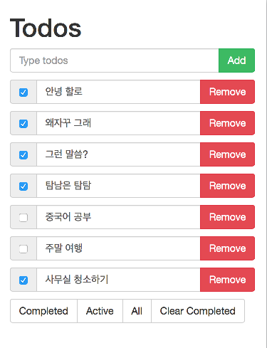
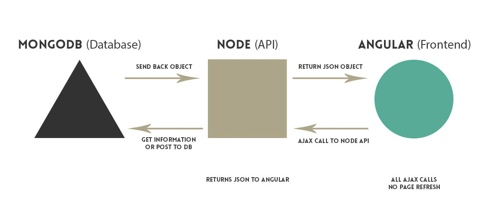

todomvc-angular
===============

## 0. 우리가 만들 Todo 앱 미리보기



* 투두(Todo) 목록을 웹페이지에 보여줌
* 투두의 조회, 추가, 편비, 삭제, 완료 처리할 수 있음 (CRUD)
* 투두의 상태에 따라 completed, active로 필터링 할 수 있음
* 투두 데이터는 서버에서 관리함


### 프로젝트 구조

* 서버는 [Node.js](https://nodejs.org/en/)기반의 [Express.js](http://expressjs.com) 웹프레임웍을 사용함
* 서버는 1) html, css, javascript 등의 정적 파일을 제공하고 2) ajax 기능을 수행할 api를 제공함  
* 웹페이지는 [Angular.js](https://angularjs.org)를 사용한 하나의 페이지(index.html)로 구성됨
* 앵귤러 컨트롤러로 웹페이지를 조작하고 앵귤러 서비스를 통해 백엔드 api와 통신함



출처: [https://scotch.io/tutorials/creating-a-single-page-todo-app-with-node-and-angular](https://scotch.io/tutorials/creating-a-single-page-todo-app-with-node-and-angular)


## 1. 노드 설치

* [https://nodejs.org/en/](https://nodejs.org/en/)에서 다운로드 후 설치
* 설치 확인:

```
$ node --version
$ which node
```

* 간단한 노드 스크립트 확인:

```
> console.log('hello world!')
hello world!

> var name = 'Chris'
> name
'Chris'
```

```
> const name = 'Chris'
> name
'Chris'

> name = 'Mars'
'Mars'

> name
'Chris'
```

### NPM

* Node Package Manager
* 노드 패키지를 프로젝트에 추가, 삭제하거나 만든 패키지를 배포할 때 사용함.
* 본 프로젝트에서는
  * angularjs등 외부 라이브러리를 설치하고
  * 노드 서버를 구동하는데 사용함
* 노드를 설치하면 자동으로 NPM도 설치됨
* 설치확인:

```
$ npm --version
$ which npm
```

*  NPM으로 프로젝트 생성:

```
$ npm init
```


## 2. 앵귤러 로딩

* index.html 페이지 생성:

```
$ touch index.html
```

* index.html:

```html
<!DOCTYPE html>
<html lang="en">
<head>
  <meta charset="UTF-8">
  <meta name="viewport"
        content="width=device-width, initial-scale=1, user-scalable=yes">
  <title>Angular | TodoMVC</title>
</head>
<body>
</body>
</html>
```

* NPM으로 앵귤러 설치:

```
$ npm install angular --save
```

--save 옵션을 붙여주면 angular를 우리 패키지에 추가했다라는 것을 패키지에 기록을 남길 수 있다.  
save 옵션을 안 주면 사용한 외부 라이브러리가 package.json에 dependency에만 기록이 남고,  
이 프로젝트를 다른 사람이 받아서 ```npm install```을 해주면 dependency에 있는 걸 알아서 설치한다.

* index.html에 앵귤러 로딩

```html
<!-- 'todomvc'라는 앵귤러 모듈을 사용한거라고 브라우저에게 알리는 것 -->
<html ng-app="todomvc">

<!--TodomvcCtrl라는 컨트롤러를 사용하겠다고 브라우저에게 알리는 것-->
<body ng-controller="TodomvcCtrl">
```

```html
<!-- ng-app으로 todomvc 앵귤러 모듈 사용을 브라우저에게 알린다 -->
<body ng-app="todomvc">

<!-- 앵귤러 라이브러리 로딩 -->
<script src="node_modules/angular/angular.js"></script>

<!--todomcv 모듈 로딩-->
<script src="js/app.js"></script>
</body>
```

* 앵귤러 모듈 정의 (js/app.js):

```javascript
angular.module('todoapp', []);
```

* 브라우져로 로딩하면 앵귤러 라이브러리와 우리가 만든 파일 두 개 (index.html, app.js)가 다운로드 됨


## 3. 컨트롤러

* html로 작성된 템플릿과 연결되어 데이터를 출력하고 사용자 입력을 처리하는 것이 컨트롤러의 역할
* `angular.module().controller()` 함수로 컨트롤러 정의
* js/controllers/TodomvcCtrl.js:

```javascript
angular.module('todomvc')
    .controller('TodomvcCtrl', function ($scope) {

      $scope.message = 'Hello world!';

    });
```

* 컨트롤러스  생성과 동시에 스코프변수(`$scope`)가 자동으로 생서됨
* 스코프 변수의 역할: 템플릿(ex. html 파일)과 컨트롤러(angular 모듈)간의 데이터 연결
* index.html에 스코프 변수 출력하기 (인터폴레이션 문법)

```html
<body ng-controller="TodomvcCtrl">
  <p>
    {{ message }} <!-- "Hello world!" -->
  </p>
</body>

```

## 4. 투두 목록 출력하기

* 컨트롤러에 배열 데이터 `todos` 만들기
* js/controllers/TodomvcCtrl.js:

```javascript
angular.module('todomvc')
    .controller('TodomvcCtrl', function ($scope) {

      $scope.todos = [{
        id: 1,
        title: '요가 수행하기',
        completed: false
      }, {
        id: 2,
        title: '어머니 용돈 드리기',
        completed: true
      }];

    });
```

* ngRepeat으로 배열 출력하기
* index.html:

```html
<ul ng-repeat="todo in todos track by $index">
  <li>
      <input type="checkbox" ng-model="todo.completed">
      <input type="text" ng-model="todo.title">
      <button type="button">Remove</button>
  </li>
</ul>
```

* ngClick으로 삭제 기능 만들기
* index.html:

```html
<!-- ng-click 디렉티브로 컨트롤러의 remove() 함수와 연결했다. -->
<button type="button" ng-click="remove(todo.id)">Remove</button>
```

* js/controllers/TodomvcCtrl.js:

```javascript
angular.module('todomvc')
    .controller('TodomvcCtrl', function ($scope) {

      $scope.remove = function (id) {
        if (!id) return;

        // 배열에서 제거할 인덱스를 검색
        var deleltedTodoIdx = $scope.todos.findIndex(function (todo) {
          return todo.id === id;
        });

        if (deleltedTodoIdx === -1) return;

        // 배열에서 제거
        $scope.todos.splice(deleltedTodoIdx, 1);
      }

    });
```

## 5. 새로운 투두 추가하기

* 앵귤러로 폼 작성하기
* index.html:

```html
<form ng-submit="addTodo(newTodo)">
  <input type="text" ng-model="newTodo" placeholder="Type todos" autofocus>
  <button type="submit">Add</button>
</form>
```

* 폼 입력 필드를 입력한 뒤 엔터를 입력하면 `ng-submit`에 바인딩된 컨트롤러 함수(`addTodo()`)가 동작함

* 투두를 추가하는 컨트롤러함수 작성하기

```javascript
angular.module('todomvc')
    .controller('TodomvcCtrl', function ($scope) {

      $scope.addTodo = function (todoTitle) {
        todoTitle = todoTitle.trim();
        if (!todoTitle) return;

        // 새로 추가할 아이디 계산
        var newId = !$scope.todos.length ?
            1 : $scope.todos[$scope.todos.length - 1].id + 1;

        // 새로운 투두 객체
        var newTodo = {
          id: newId,
          title: todoTitle,
          completed: false
        };

        // todos 배열에 새로운 투두 추가
        $scope.todos.push(newTodo);
      };
    });
```

## 6. 부트스트랩으로 꾸미기

* NPM으로 부트스트랩 설치

```
$ npm instsall bootstrap --save
```
* index.html에 라이브러리 로딩

```html
<link rel="stylesheet" href="node_modules/bootstrap/dist/css/bootstrap.css">
```

* 부트스트랩 클래스 적용하기


```html
<!DOCTYPE html>
<html lang="en">
<head>
  <meta charset="UTF-8">
  <meta name="viewport"
        content="width=device-width, initial-scale=1, user-scalable=yes">
  <title>Angular | TodoMVC</title>
  <link rel="stylesheet"
        href="node_modules/bootstrap/dist/css/bootstrap.min.css">
</head>
<body ng-app="todomvc">
<div ng-controller="TodomvcCtrl" class="container">
  <h1>Todos</h1>

  <ul class="list-unstyled">
    <li>
      <form ng-submit="addTodo(newTodo)">
        <div class="input-group">
          <input type="text" ng-model="newTodo" class="form-control"
                 placeholder="Type todos" autofocus>
          <span class="input-group-btn">
            <button class="btn btn-success" type="submit">Add</button>
          </span>
        </div>
      </form>
    </li>
  </ul>

  <ul ng-repeat="todo in todos" class="list-unstyled">
    <li class="todo-item">
      <div class="input-group">
        <span class="input-group-addon">
          <input type="checkbox" aria-label="..." ng-model="todo.completed">
        </span>
        <input type="text" class="form-control" aria-label="..." ng-model="todo.title">
        <div class="input-group-btn">
          <button class="btn btn-danger" ng-click="remove(todo.id)">Remove</button>
        </div>
      </div>
    </li>
  </ul>

  <pre>{{todos | json}}</pre>

</div>

<script src="node_modules/angular/angular.js"></script>
<script src="js/app.js"></script>
<script src="js/controllers/TodomvcCtrl.js"></script>

</body>
</html>
```

## 7. 투두 목록 필터링

* 출력된 투두목록을 아래 기준으로 필터링해 보자
  * `completed`: 완료된 투두 리스트
  * `active`: 미완료된 투두 리스트
  * `all`: 모든 투두 리스트

* `ngRepeat`의 필터링 기능
* index.html:

```html
<ul ng-repeat="todo in todos | filter: {completed: true}">
```

* 필터 버튼 만들기
* index.html:

```html
<div class="btn-group" role="group" aria-label="...">
  <button type="button" ng-click="status='completed'">Completed</button>
  <button type="button" ng-click="status='active'">Active</button>
  <button type="button" ng-click="status=''">All</button>
</div>
```

* 버튼을 클릭할때 마다 `$scope.status` 변수의 값이 변경됨
* 이 변수의 값에 따라 `$scope.statusFilter`에 ngRepeat을 위한 필터 객체를 할당함
* index.html:

```html
<ul ng-repeat="todo in todos | filter:statusFilter">
```
* `$scope.status`를 어떻게 변경 감지할까? `$watch()` 함수를 사용
* 필터버튼을 클릭하고 `status` 값이 변경되면 `$watch()`에 등록한 함수가 동작함
* js/controllers/TodomvcCtrl.js:

```javascript

$scope.$watch('status', function () {
  if ($scope.status === 'completed') {        // if Completed 클릭시
    $scope.statusFilter = {completed: true};  //   필터를 설정한다.
  } else if ($scope.status === 'active') {    // if Active 클릭시
    $scope.statusFilter = {completed: false}; //   필터를 설정한다.
  } else {                                    // if All 클릭시
    $scope.statusFilter = {};                 //   필터를 해제한다.
  }
});
```

### [DIY] Clear All 버튼 추가하기


## 8. 디렉티브

* 디렉티브는 html과 자바스크립트 코드로 이뤄지 마크업
* 디렉티브를 잘 읽기 쉬운 코드를 만들 수 있고 재사용 가능함
* 투두 템플릿을 디렉티브로 분리하자!
* index.html:

```html
<ul ng-repeat="todo in todos | filter:statusFilter" class="list-unstyled">
  <li class="todo-item">

    <!-- 한 줄로 바꿔보자 ! -->
    <todo-item></todo-item>
  </li>
</ul>
```

* `angular.module().directive()` 함수로 디렉티브 정의
* js/directives/todoItem.js:

```javascript
angular.module('todomvc')
    .directive('todoItem', function () {
      return {
        restrict: 'E',
        template: '<div>todoItem</div>'
      };
    });
```

* 컨트롤러 스코프 데이터를 디렉티브에 연결

```html
<todo-item todo="todo" remove="remove(todo.id)"></todo-item>
```

* 연결된 데이터를 디렉티브에서 출력

```javascript
angular.module('todomvc')
    .directive('todoItem', function (){
      return {
        restrict: 'E',
        scope: {        // 디렉티브 스코프 설정
          todo: '=',    // 양방향 바인딩
          remove: '&'   // 참고 바인딩. 함수 설정시 사용함
        },
        template:
        '<div class="input-group">' +
          '<span class="input-group-addon">' +
            '<input type="checkbox" aria-label="..." ng-model="todo.completed" ng-click="update(todo)">' +
          '</span>' +
          '<input type="text" class="form-control" aria-label="..."' +
            'ng-model="todo.title" ng-blur="update(todo)">' +
          '<div class="input-group-btn">' +
            '<button class="btn btn-danger" ng-click="remove(todo)">Remove</button>' +
          '</div>' +
        '</div>'
      }
    });
```

### [DIY] 필터버튼을 디렉티브로 분리해 보자!


## 9. 서비스

* 기존 컨트롤러에는 두개 기능이 섞여 있음
  * 사용자 이벤트를 감지하고 템플릿에 데이터를 보내주는 역할, 즉 **템플릿과 직접 연결되는 부분**
  * 그리고 todos 배열에서 투두를 제거하거나 추가하는 역할, 즉 **데이터를 핸들링 하는 부분** (-> 서비스로 분리)
* `angular.module().factory()` 함수로 서비스 정의
* js/services/todoStorage.js:

```javascript
angular.module('todomvc')
    .factory('todomvcStorage', function () {

      var storage = {
        todos: [{
          id: 1,
          title: '요가 수행하기',
          completed: false
        }, {
          id: 2,
          title: '어머니 용돈 드리기',
          completed: true
        }],

        get: function () {
          return storage.todos;
        },

      return storage;
    });
```

* 정의한 서비스를 컨트롤러에 주입하여 사용
* js/controllers/TodomvcCtrl.js:

```javascript
angular.module('todomvc')
    .controller('TodomvcCtrl', function ($scope, todomvcStorage) {

      $scope.todos = todomvcStorage.get();

    });
```

### [DIY] 추가, 삭제, Clear Completed 도 서비스로 옮겨보자!


## 10. Express.js로 웹서버 만들기

* 웹서버의 기능
  * 정적파일 호스팅
  * API 기능
* express 모듈 설치:

```
$ npm install express --save
```  

* express 공식 사이트의 [hello world](http://expressjs.com/en/starter/hello-world.html) 코드 사용
* npm으로 서버 구동하기
* package.json:

```json
{
  "scripts": {
    "start": "node server/app"
  }
}
```

```
$ npm start
```


## 11. Static Files

* index.html 등 정적파일을 웹서버에서 호스팅해야함.
* server.js

```javascript
app.use('/', express.static(path.join(__dirname, '../client')));
```

* 홈페이지 라우팅 설정

```javascript
app.get('/', function (req, res) {
  res.sendfile('index.html');
});
```

* 라이브러리 파일도 호스팅 설정

```javascript
app.use('/node_modules', express.static(path.join(__dirname, '../node_modules')));
```

## 12. APIs

* 클라이언트와 서버간의 데이터 교환을 위한 프로토콜 필요
* 클라이언트는 Ajax를 이용해 서버로 데이터를 요청함
* 이것이 APIs
* 앵귤러 서비스는 ajax를 통해 서버로 데이터를 요청함

### REST API

* 서버 자원단위로 설계된 API
* 명사와 동사의 분리 (`GET /users` v.s `/get_users`)
* 우리가 만들 api 목록

method	|url	| function
--------|-----|---------
POST	  | /api/todos	      | todo 생성
GET	    | /api/todos	      | todo 목록 조회
PUT	    | /api/todos/:id	  |todo 갱신
DELETE	| /api/todos/:id	  |todo 삭제

### GET /api/todos 만들기

* server/app.js:

```javascript
// 앵귤러 서비스쪽에 있던 배열을 노드 코드로 옮겼다.
var todos = [{
  id: 1,
  title: 'todo 1',
  completed: false
}, {
  id: 2,
  title: 'todo 2',
  completed: false
}, {
  id: 3,
  title: 'todo 3',
  completed: true
}];

// GET /api/todos 라우팅 설정
app.get('/api/todos', function (req, res) {
  res.json(todos);
});
```

### Postman

* [다운로드](https://www.getpostman.com/)
* REST API 개발 필수품

### BodyParser

* post 메쏘드는 데이터를 보낼때 http 바디에 그 정보를 저장함
* express에서 리퀘스트 바디에 접속하기 위한 미들웨어
* body-parser 설치:

```
$ npm isntall bady-parser --save
```
$ server/app.js:

```javascript
var bodyParser = require('body-parser');

// body parser
app.use(bodyParser.json());
app.use(bodyParser.urlencoded({ extended: true }));
```

### POST /api/todos 만들기

* server/app.js

```javascript
app.post('/api/todos', function (req, res) {
  if (!req.body.title) {
    return res.status(400).send();
  }

  var newId = !todos.length ?
      1 : todos[todos.length - 1].id + 1;

  var newTodo = {
    id: newId,
    title: req.body.title,
    completed: false
  };

  todos.push(newTodo);

  res.json(newTodo);
});
```


### [DIY] Delete와 PUT은 직접 작성해보자!

* 이것으로 서버의 두 가지 기능을 모두 구현했다.
  * Static File
  * APIs

## 13. $http로 앵귤러 서비스 개선하기

* 앵귤러 서비스에서 api 호출을 위해 `$http` 서비스 사용
* js/services/todomvcStorage.js:

```javascript
angular.module('todomvc')
    .factory('todomvcStorage', function ($http) {
      var storage = {

        todos: [],

        get: function (callback) {
          $http.get('/api/todos')                 // GET /api/todos 요청
              .then(function success(response) {  // 성공
                console.log(response);
                callback(null, angular.copy(response.data, storage.todos));
              }, function error(err) {            // 실패
                console.error(err);
                callback(err);
              });
        },
      };
    });
```

* 컨트롤러 코드 살짝 변경
* js/controllers/TodomvcCtrl.js:

```javascript
angular.module('todomvc')
    .controller('TodomvcCtrl', function ($scope, todomvcStorage) {

      // 비동기 함수이미로 콜백 함수를 파라매터로 넘겼다.
      todomvcStorage.get(function (err, todos) {
        if (err) return;
        $scope.todos = todos;
      });

    });    

```

### [DIY] PUT/DELETE도 구현해 보자!
